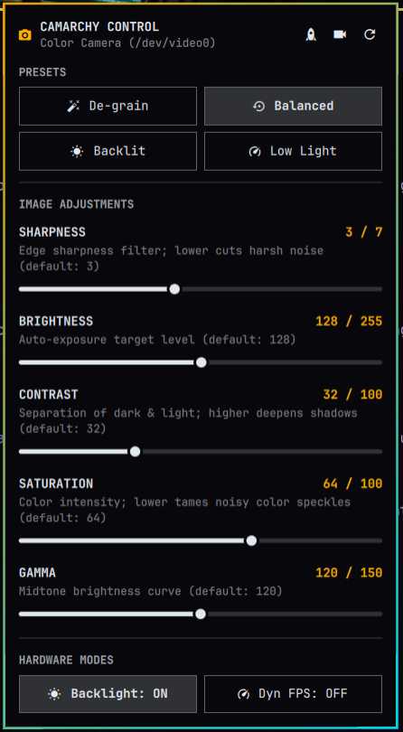

# Camarchy Control

Hardware webcam controls, tuning presets, and live viewfinder for the **Omarchy** desktop environment.

Built with **pure QML / Quickshell** and direct `/usr/bin/v4l2-ctl` hardware integration, Camarchy gives you instant, tactile control over your webcam's image quality directly from the Omarchy top bar.



---

## Features

### 1. Direct Hardware V4L2 Tuning
Adjust sensor properties in real-time with responsive slider controls:
* **Sharpness**: Tame harsh web camera digital oversharpening and sensor noise.
* **Brightness**: Fine-tune target exposure levels.
* **Contrast**: Deepen blacks or soften shadows.
* **Saturation**: Balance vibrant tones or desaturate color noise.
* **Gamma**: Adjust midtone brightness curves for flattering skin tones.

### 2. Four One-Click Presets
Switch visual profiles instantly to match your lighting conditions:
* **De-grain**: Softens edge sharpening and turns off backlight boost for a clean, natural image in standard lighting.
* **Balanced**: Default hardware baseline calibrated for daily conferencing.
* **Backlit**: Increases backlight compensation and lifts exposure when sitting in front of windows or bright lights.
* **Low Light**: Enables dynamic framerate exposure accumulation to brighten dim evening environments.

### 3. Privacy-First Live Viewfinder
* Native 1080p MJPEG preview window with hardware-accelerated GPU mirroring.
* **Zero Resource Leakage**: The camera capture session is loaded strictly on demand and destroyed immediately when the panel closes or preview is toggled off, immediately freeing `/dev/video*` and extinguishing the physical camera activity LED.
* Collapsible with one click (`󰕦` / `󰕧`) so you can adjust controls with or without active preview.

### 4. Multi-Camera Cycling
Cycle between connected USB webcams and built-in sensors with the header switcher (`󰑣`), automatically ignoring virtual loopback devices.

### 5. Hardened, Zero-Privilege Security Architecture
* **Direct Argv Execution**: All hardware adjustments invoke `/usr/bin/v4l2-ctl` via structured argument vectors—no shell wrappers, no `bash -c`, no string concatenation, and no command-line leakage.
* **Producer-Side Output Capping & Deadlines**: Hardware control querying runs under a hard 2-second timeout and 32 KiB stdout cap (`head -c 32768`), automatically reaping child processes and preventing memory growth in the persistent shell.
* **Strict PlainText Rendering**: All device-supplied strings and metadata are explicitly rendered as `Text.PlainText`, preventing rich-text/HTML interpretation and unauthorized remote image loads.
* **Strict Parameter Allowlisting**: Every control parameter is validated against an explicit whitelist and device paths are verified against strict `/^\/dev\/video\d+$/` patterns.
* **Unprivileged**: Operates entirely within standard user permissions (`video` group).

---

## Installation

Install directly using the Omarchy CLI:

```bash
omarchy plugin add https://github.com/layolayo/omarchy-camarchy-control.git --enable
```

Or add it to your bar layout via Omarchy Bar Settings or `~/.config/omarchy/shell.json`.

---

## Removal

To disable or completely remove the plugin:

```bash
# Disable the plugin
omarchy plugin disable io.github.layolayo.camarchy-control

# Remove from system
omarchy plugin remove io.github.layolayo.camarchy-control
```

---

## Prerequisites

* **v4l-utils**: Standard system package providing `/usr/bin/v4l2-ctl`.
* **Quickshell / QtMultimedia**: Standard Omarchy desktop multimedia runtime.

---

## License

MIT License. Copyright (c) 2026 Matthew Hudson.
